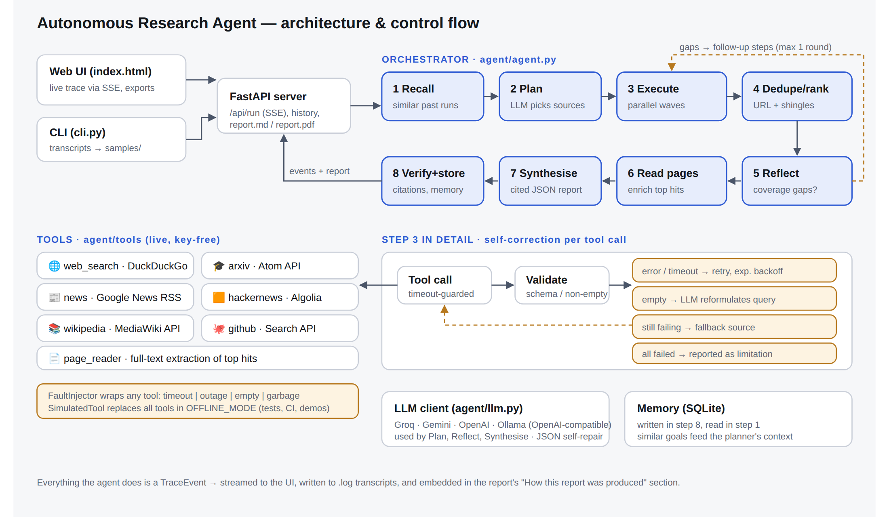

# Autonomous Research Agent

An agent that takes a research goal, **plans before acting**, **chooses its own sources**, gathers evidence **in parallel** from live public APIs, **removes duplicate and irrelevant content**, **recovers from failures**, checks its own coverage and citations, and produces a **cited report** (Markdown / PDF / JSON). It **remembers past research**, and a web UI streams every step live.



## How it meets the brief

| Requirement | Where |
|---|---|
| Accept a goal (CLI + UI) | `cli.py`, `server.py`, `web/index.html` |
| Visible plan before acting | `agent/planner.py` → `plan` event (interpretation, sub-questions, per-step rationale) |
| ≥2 distinct tools | 6 live, key-free sources + a page reader (`agent/tools/sources.py`) |
| LLM picks sources autonomously | the planner prompt includes a tool catalogue with "best for" hints; tools the LLM invents are dropped during validation |
| Parallel gathering | `Executor.run` runs dependency "waves" with `asyncio.gather` |
| Extract, dedupe, filter | `agent/processing.py`: canonical-URL dedup, 3-gram shingle Jaccard near-dup removal, lexical relevance filter |
| Self-correction | retry with exponential backoff → LLM query reformulation → fallback source → reported as a limitation; plus a reflection loop that fills coverage gaps, and citation verification that strips hallucinated `[n]` references |
| Induced failure | `--fault timeout\|outage\|empty\|garbage` (CLI) or the UI's "Failure injection" panel |
| Structured output | report with summary, key points, findings, actionable insights, limitations and references; exports to Markdown, PDF and JSON |
| Memory | SQLite; similar past goals are recalled into the planner's context; browsable history in the UI |
| Audit trail | every action is a `TraceEvent`, streamed over SSE and saved as `.log` transcripts |

## Quick start

```bash
python -m venv .venv && source .venv/bin/activate
pip install -r requirements-dev.txt
cp .env.example .env            # add GEMINI_API_KEY (aistudio.google.com) or GROQ_API_KEY
uvicorn server:app --reload     # open http://localhost:8000
```

CLI:

```bash
python cli.py "Research and summarize the top 3 developments in small language models from the last week"
python cli.py "Competitive landscape brief for Perplexity AI" --fault outage --fault-tool web_search --out samples/demo
python cli.py "anything" --offline     # simulated tools + heuristic planner, no network or key needed
python -m pytest -q                    # 15 offline tests
```

**No key?** The agent still runs. It uses a rule-based planner and extractive summaries over live sources. `OFFLINE_MODE=1` also swaps the tools for deterministic simulated ones, which the tests use.

## Deploy

[](https://render.com/deploy?repo=https://github.com/kushwaha001/research-agent)

- **Render:** push to GitHub → New → Blueprint → select the repo (`render.yaml` is included) → paste your `GEMINI_API_KEY` when prompted. Render builds the Dockerfile and gives you a public `*.onrender.com` URL.
- **Hugging Face Spaces:** create a Docker Space, push this repo, and add `GROQ_API_KEY` as a secret. The app listens on port 7860.
- **Any Docker host:** `docker build -t research-agent . && docker run -p 7860:7860 -e GROQ_API_KEY=... research-agent`

Memory is SQLite in `data/`. On free hosts with ephemeral disks it resets whenever the service redeploys.

## Project layout

```
agent/
  agent.py        orchestrator: recall → plan → execute → dedupe → reflect → read → synthesise → verify → store
  planner.py      LLM planner (validated) + rule-based fallback + query reformulation
  executor.py     parallel waves, retries/backoff, reformulate, fallback, page enrichment
  processing.py   relevance scoring, URL + near-duplicate removal, citation numbering
  synthesizer.py  cited JSON report, coverage critic, citation verification, extractive fallback
  memory.py       SQLite run store + similar-goal recall
  report.py       Markdown and PDF rendering
  llm.py          OpenAI-compatible client (Groq/Gemini/OpenAI/Ollama), JSON repair
  tools/          live sources, simulated tools, FaultInjector
server.py         FastAPI + SSE        web/index.html   single-file UI
cli.py            CLI + transcripts    tests/            pytest suite
samples/          3 transcripts (.log), reports (.md/.pdf) and full runs (.json)
docs/             architecture diagram, WRITEUP.md
```

## Assumptions, mock data and simulated tools

- No dataset is used. All evidence comes from public APIs at run time: DuckDuckGo HTML, Google News RSS, Wikipedia, arXiv, HN Algolia and GitHub. None of them need keys.
- The **committed sample transcripts were produced in offline mode** (simulated tools marked `[SIMULATED]`, heuristic planner) because the build environment had no internet access. They show the control flow and recovery paths exactly. To produce live transcripts, run the same three commands with a key set.
- DuckDuckGo's HTML endpoint can rate-limit or block bots. When that happens the executor falls back to Wikipedia automatically. For heavy use, swap in a keyed search API such as Tavily or Brave.
- Relevance and near-duplicate detection are deliberately lexical (fast and explainable), not embedding-based. See the write-up.
